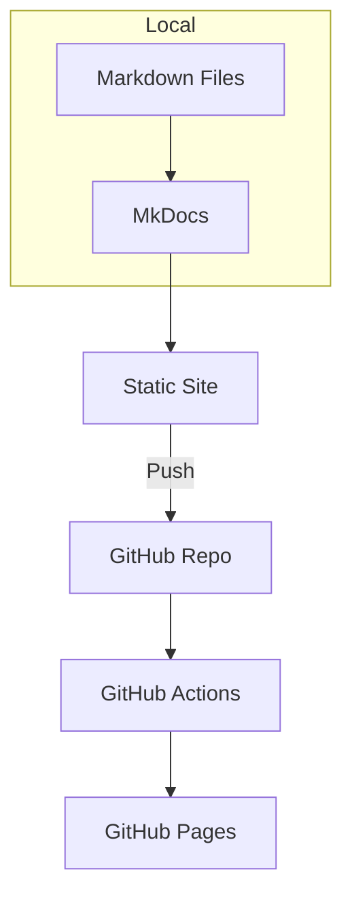
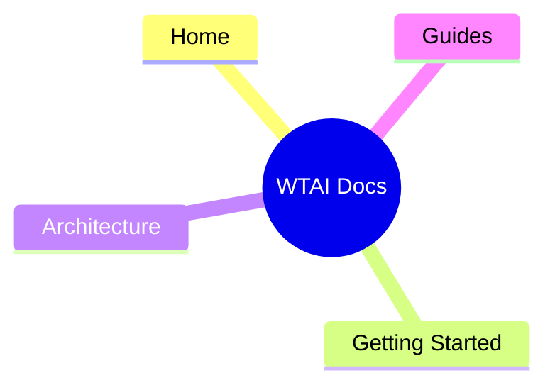

# Architecture

Core components and deployment for the WTAI documentation site.

## Site components

- MkDocs core
- Material theme
- GitHub Pages deployment

## Mermaid diagram: High-level architecture

## Mermaid diagram: Navigation structure

