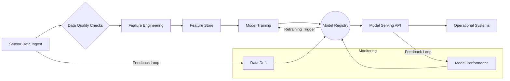
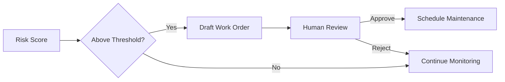
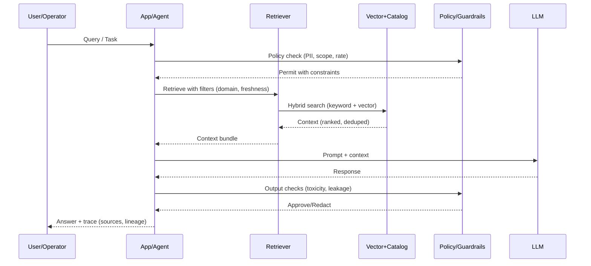

# AI in Operations: PdM, Optimization, and Agentic Workflows

## Introduction: activating the architecture
We now turn on the factory we designed. This session focuses on applying AI safely and reliably in operations across three patterns: predictive analytics (PdM), prescriptive analytics (optimization), and agentic workflows with governance. Key artifacts: RAG Risk Register and Evaluation Rubric.

## Pattern 1: Predictive Maintenance (PdM{:abbr="Predictive Maintenance"}) pipelines
A PdM solution is a living pipeline on top of your platform, not a one‑off model.

- Ingest & quality: automated QA for missing/offline/out‑of‑range signals.
- Feature engineering: domain features (e.g., rolling averages) become reusable assets.
- Feature/embedding store: promotes consistency and reuse across models.
- Model registry: versions, metrics, lineage, approvals.
- Serving & monitoring: real‑time scoring with drift/performance monitoring and retraining triggers.

Risk‑aware PdM decisioning

## Pattern 2: Optimization and prescriptive analytics
Prediction tells you what might happen; optimization tells you what to do subject to constraints.

Examples
- Production allocation: optimal flow configuration to meet targets at lowest cost.
- Spares planning: inventory levels by site balancing downtime risk and cost.
- Energy balancing (renewables): schedule charge/discharge vs forecast prices and solar.

Techniques include operations research (linear/mixed‑integer programming) and reinforcement learning for policy search under constraints.

## Pattern 3: Agentic workflows with guardrails
Agents plan and use tools; governance ensures safe operation. RAG{:abbr="Retrieval‑Augmented Generation"} provides grounded knowledge; policies enforce input/output safety and traceability.

Checklist for governed agents
- Input policy checks before retrieval.
- Filtered retrieval with domain/freshness constraints.
- Output checks for safety and leakage; redact when needed.
- Traceability with citations; local language support (e.g., N‑ATLAS) when appropriate.

## Human‑in‑the‑loop and managing risk
Safety‑critical environments require human‑machine teaming. Use:
- RAG Risk Register to list risks, mitigations, and owners (hallucinations, stale docs, misuse).
- Evaluation Rubric to define correctness, relevance, safety, completeness.

## Conclusion and transition
You now have three AI patterns operating on your platform: forecasting (PdM), deciding (optimization), and assisting (agents) with governance. Next: the Data Product Operating Model and Data Contracts—who owns what, how backlogs and SLOs/SLA are managed, and how value is delivered at scale.
