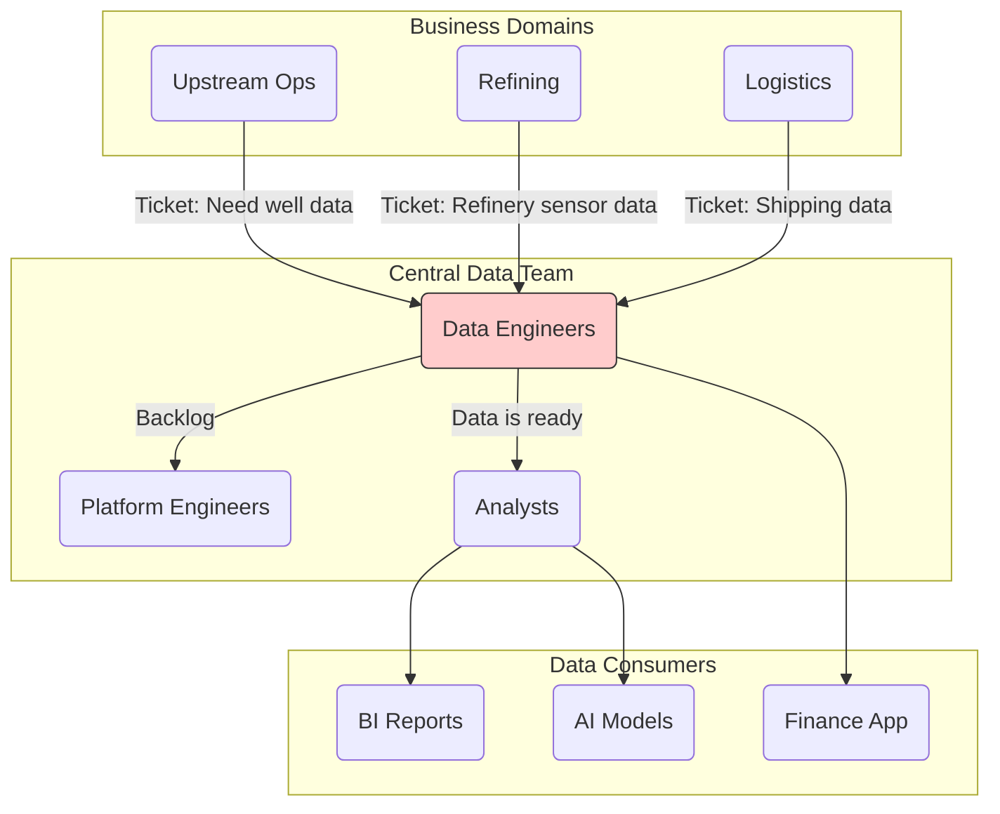
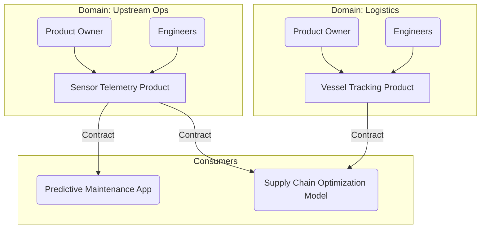
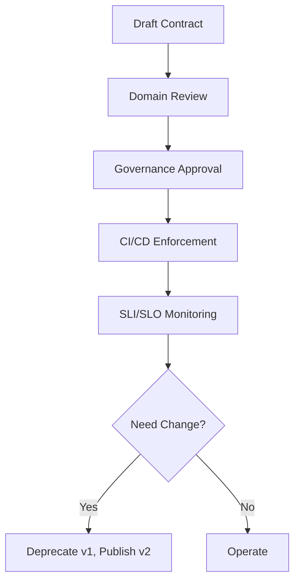

# The Data Product Operating Model & Data Contracts

## Introduction: the scaling problem
Many data initiatives fail to scale not because of technology, but because of the operating model. Treating data as a byproduct managed by a central team doesn’t scale. Shift from project/service‑ticket mindset to product ownership. Key artifacts: Data Product Canvas and Data Contract Template.

## The old way: the centralized bottleneck
Central teams become backlogs; context is lost; ownership is unclear; quality suffers; pipelines are brittle.

Problems
- Loss of context and domain nuance
- No clear ownership for correctness
- Low quality and reactive cleanup
- Fragile downstream dependencies

## A new paradigm: treating data as a product (DaaP{:abbr="Data‑as‑a‑Product"})
Decentralize ownership to domains; the central team becomes a platform enabling self‑service.

Product includes data, code, infra, metadata, owner, version, and interface. Domains create; platform team provides tooling and guardrails.

## The API for data: data contracts
A data contract is a formal, machine‑readable agreement between producer and consumers. It defines expectations and becomes part of CI/CD.

Contract lifecycle

Contract components
- Schema: columns, types, constraints; versioning for changes
- Semantics: precise business meaning (e.g., prod_vol: daily crude volume, bbl at STP)
- Quality & reliability (SLOs/SLIs):
  - Freshness: updated daily by 06:00 AM WAT
  - Completeness: monthly data > 99.5% of active wells
  - Accuracy: percent of readings within valid ranges
- PII & security: fields with PII; masking/tokenization; access tiers
- Lifecycle & deprecation: support windows per version; deprecation policy

Enforcement: contract is code in the deployment pipeline; violating changes fail builds.

## Interactive: your first data product canvas
Choose a core dataset for your pilot (e.g., Sensor Telemetry Product or User Intent Signals). Fill the canvas: owner, consumers, purpose, 1–2 critical SLOs.

## Conclusion and transition
This operating model—decentralized ownership + data contracts + platform enablement—scales value without scaling chaos. Next: workforce and culture—roles, skills, and adoption mechanics to make the model stick.
