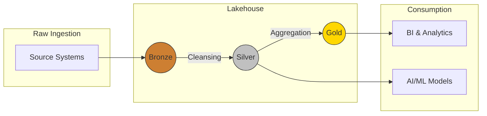
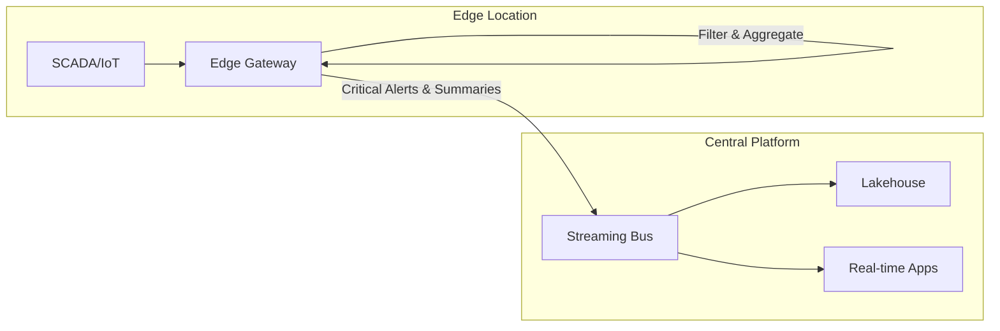
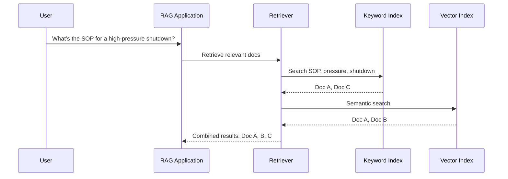
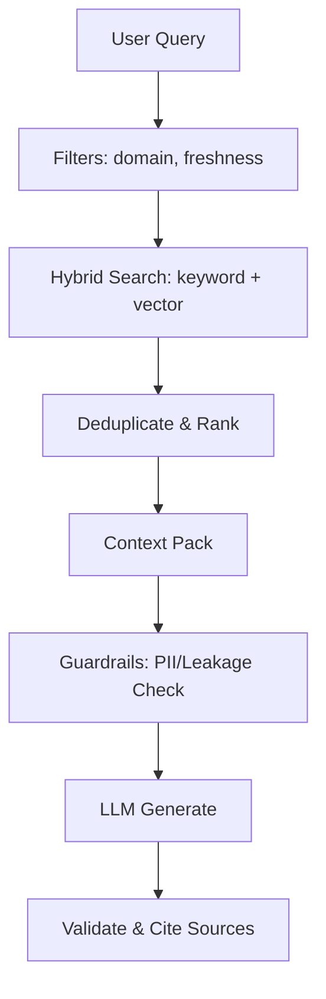
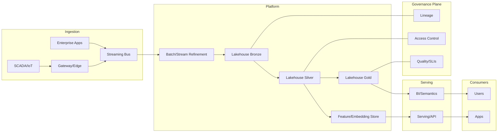

# Reference Architectures for Analytics in Operations

## Introduction: from why to how
We move from measurable value hypotheses to technical blueprints. The goal is to select a baseline, platform‑agnostic architecture and define key non‑functional requirements (latency, cost) for your pilot. We focus on patterns, not vendors; you can realize these on Azure, AWS, SAP, or hybrid.

## The modern data lakehouse
Warehouses were reliable but inflexible; lakes were flexible but messy. The lakehouse combines both, with the Medallion pattern to refine data from raw to business‑ready.

- Bronze (raw): complete historical archive; raw sensor readings, JSON from apps, reports.

- Silver (cleansed & conformed): standardized formats, joins, validated single source of truth.

- Gold (aggregated & business‑ready): KPI‑level views feeding BI and executive reporting.

## Handling velocity: streaming and edge analytics
Operational use cases need data in motion. A streaming bus ingests high‑velocity events; edge computing filters/aggregates near sources to reduce latency and bandwidth while keeping critical alerts real‑time.

Examples
- O&G: edge detects pressure anomalies; alerts via streaming bus; summaries land in lakehouse.

- Renewables: edge buffers telemetry during outages, streams when restored.

- Telecom: streaming feeds real‑time churn scoring.

## Unlocking unstructured data: retrieval architectures
Hybrid search powers RAG{:abbr="Retrieval‑Augmented Generation"} systems: combine keyword search for precision with vector search for semantic similarity.

This lets engineers ask natural‑language questions and get grounded answers with citations.

Retrieval quality and guardrails

## The full blueprint
A modern platform fuses lakehouse, streaming/edge, retrieval, and a governance plane.

Use this map to select components for your 90‑day pilot: do you need real‑time streaming, vector search, both, or neither?
