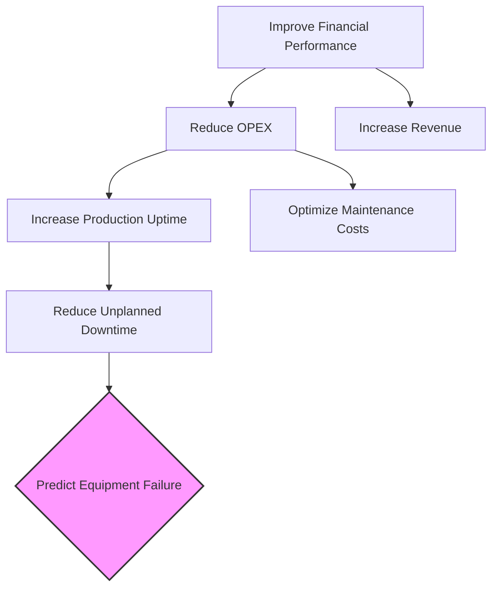
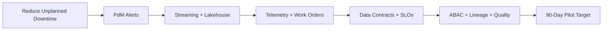

# Why Now? Business Value from Data + AI

## Introduction & setting the stage
Good morning and welcome to Day 4 of the Advanced Data Management Masterclass. Over the next two days, we connect modern data and AI capabilities directly to business outcomes. Today is about moving from strategy to an operating model. By the end of the day, you will have designed a 90‑day pilot for your organization.

In this first hour we answer: Why now? Why is this more urgent than three or five years ago? We anchor the discussion in business value and learn to translate every data initiative into clear impact on key performance indicators (KPIs).

## The convergence: three forces driving change
### 1) Economic drivers
- Oil & Gas: maximize operational efficiency, improve safety, navigate the energy transition. Targets include reducing OPEX, increasing production uptime, and minimizing environmental impact.
- Telecommunications: reduce churn and defend ARPU in a hyper‑competitive market.
- Renewables: efficiently manage a rapidly growing fleet of distributed assets.

### 2) Technology maturity and affordability
Cloud storage/compute costs have dropped. Modern architectural patterns like the lakehouse let us process, store, and analyze petabyte‑scale sensor data in near real‑time—formerly cost‑prohibitive.

### 3) AI accessibility
Large Language Models and Retrieval‑Augmented Generation (RAG{:abbr="Retrieval‑Augmented Generation"}) unlock value from unstructured data such as maintenance reports, safety manuals, and geological surveys. Locally, N‑ATLAS supports Yoruba, Hausa, Igbo, and Nigerian‑accented English, making AI directly applicable to field operations in Nigeria.

## Speaking the language of value: KPI trees
This KPI Tree deconstructs a strategic objective into measurable drivers that data/AI can influence.

Interpretation: the board‑level goal “Improve Financial Performance” cascades to concrete levers. Following the OPEX path: improving production uptime reduces unplanned downtime, which we influence by predicting equipment failure.

KPI tree to architecture mapping

### Cross‑industry patterns
- Telecommunications: Reduce Churn → Increase Customer Satisfaction → Proactive Retention Offers → Predict Churn Intent.
- Renewables: Increase Energy Yield → Maximize Asset Availability → Reduce Repair Time → Predict Inverter Failures.

## Interactive: your value hypothesis (0:40–0:55)
Use the Value Hypothesis Canvas to tie actions to measurable outcomes.

Template: We believe that by doing [INITIATIVE], for [PERSONA], we will achieve [OUTCOME], as measured by [METRIC].

Example (O&G): We believe that by implementing a predictive maintenance model for critical compressors, for maintenance planners, we will reduce unplanned downtime, as measured by a 15% reduction in critical equipment failures over the next 6 months.

Activity (5–7 minutes)
1. Pick a problem in your area.
2. Draft your hypothesis using the template.
3. Identify the KPI and measurement window.

Group share (5 minutes): volunteer 1–2 examples. Tighten the linkage from initiative → KPI → measurement.

## Wrap‑up & transition (0:55–1:00)
You have articulated “why” in measurable business terms. This KPI alignment anchors all architectural and governance decisions. Next, we dive into Reference Architectures for Analytics in Operations—the blueprints for building and scaling these solutions reliably and cost‑effectively.
