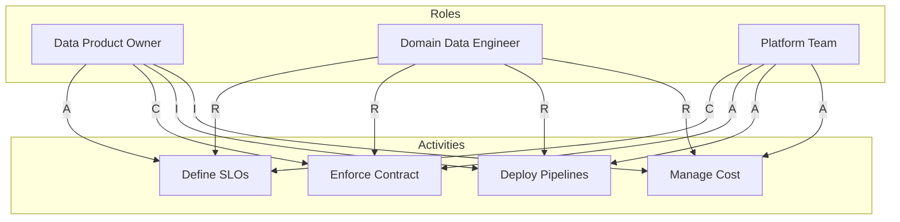
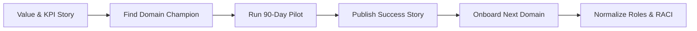
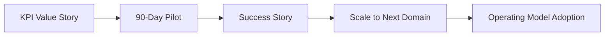

# Workforce and Culture: Roles, Skills, and Adoption

## Introduction: the human element of change
Technology succeeds when the operating model supports it. The shift to data products changes how work is organized and who owns outcomes. Key artifacts: RACI template and communications plan outline.

## Roles for a product‑centric world
### Data Product Owner (DPO{:abbr="Data Product Owner"})
Business domain expert responsible for the success of the data product.
- Value: product vision and roadmap aligned to KPI tree
- Interface: defines the data contract (schema, semantics, quality)
- SLOs: accountable for reliability
- Stakeholder management: manages consumers and backlog

### Domain‑aligned data engineer
Embedded within the domain; functionally aligned to DPO.
- Skills: deep source‑system/process knowledge plus core data engineering (streaming, lakehouse)
- Focus: build and operate the data product; enforce contract using platform tooling

### Platform team
Owning the self‑service platform (compute, storage, governance plane) and guardrails; enabling domains rather than executing for them.

## RACI for clear ownership
Use a RACI{:abbr="Responsible, Accountable, Consulted, Informed"} matrix to avoid fallback to centralized habits.

Example activities
- Define data product SLOs — A: DPO; R: Domain Engineer; C: Platform Team
- Enforce data contract — A: Platform Team; R: Domain Engineer; C: DPO
- Deploy pipeline code — A: Platform Team; R: Domain Engineer; I: DPO
- Manage cloud cost — A: Platform Team; R: Domain Engineer; I: DPO

Activity: add a row for “Define the business meaning (semantics) for a new column.” Answer: A = DPO; R = Domain Engineer; C = Platform Team; I = others.

Change management flow

## Planning for cultural change and adoption
1) Start with the why (KPI connection)
- Tie DPO accountability to tangible outcomes (e.g., completeness +1% → downtime −15%).

2) Pilot‑first approach
- Use the 90‑day pilot to trial the model.
- Identify a champion domain; co‑locate the engineer with business; publish a success story.

3) Communications plan
- Audience: DPOs, Domain Engineers, Platform Team
- Core messages:
  - DPOs: “You own the asset that drives value; we provide tools.”
  - Engineers: “Move from reactive service to embedded partner with modern tooling.”
- Channels: leadership briefings, engineering workshops, central online hub

## Conclusion and transition
You now have roles, ownership, and adoption mechanics to make the product model stick. Next: the capstone workshop—re‑design a human‑machine collaboration and define a concrete 90‑day pilot.

