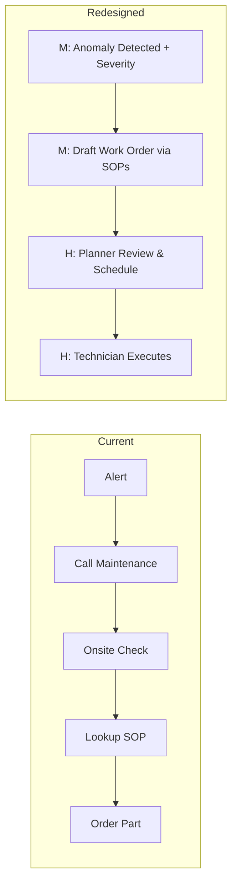
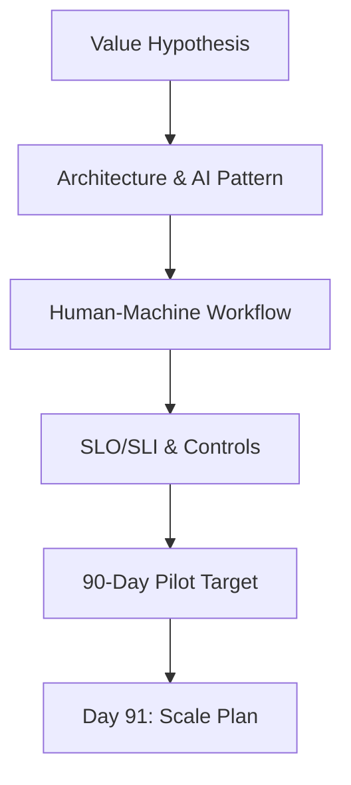

# Interactive Workshop: Human‑Machine Collaboration Redesign

## Introduction & challenge
Synthesize the day’s work into a concrete, well‑scoped 90‑day Pilot Target. Redesign an operational process (e.g., maintenance alert workflow) to define what the machine does best (prediction, retrieval, optimization) and where humans decide (judgment, safety sign‑off).

## Phase 1: current state and value target
1) Pinpoint value and scope
- Target KPI (examples): reduce unplanned downtime; improve incident resolution time.
- Current process sketch: e.g., Operator sees alert → calls maintenance → onsite check → consults SOP → orders part.

2) Define the single goal for 90 days (examples)
- PdM: predictive model for one critical compressor with 90% accuracy; reduce false alarms by 50%.
- RAG: internal agent grounded on top 10 SOPs; reduce search time by 30%.

## Phase 2: architecting collaboration and governance
3) Map technical components
- Data Product: name and version; identify the DPO.
- Architecture pattern: streaming/edge or retrieval/RAG.
- Core feature/model: e.g., rolling‑average deviation; anomaly detector.

4) Redesign the human‑machine workflow
- Machine (M): predict/retrieve/suggest.
- Human (H): review, approve, execute; human‑in‑the‑loop control point.

## Phase 3: defining success and next steps
5) Control and success criteria
- Pilot SLO/SLI: measurable success over 90 days (e.g., ≥90% accuracy).
- Governance checkpoint: single most important control (e.g., model dashboard for DPO; output policy check for RAG).
- Risk mitigation: primary risk and mitigation (e.g., drift → retraining triggers; hallucination → strict grounding + citations).

6) Path to production
- Day 91 plan: scale to additional assets or domains; expand knowledge base and controls.

## Wrap‑up & transition to Day 5
You now have a governed 90‑day pilot that connects KPI value, architecture, AI pattern, ownership, and controls. Tomorrow we move to portfolio prioritization, NDPA 2023 compliance, and the platform roadmap to scale to production.
