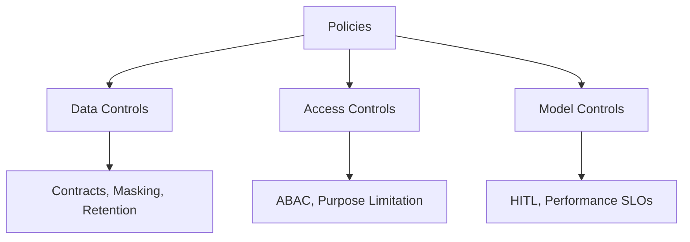

# Governance for the AI Era

## Introduction: necessary friction as an enabler
Governance enables scale by reducing chaos, legal risk, and technical debt. Shift from centralized policing to a federated, platform‑enabled control model. Core artifact: Governance Controls Checklist.

## Principle 1: federated governance and the ownership shift
- Central governance committee (the “what”): sets global policies and intent.
- Data Product Owners (the “how”): implement controls on their products; accountable for data quality and contract adherence.
- Platform team (enforcement layer): provides policy‑as‑code, RBAC/ABAC, logging, lineage, and monitoring so controls are easy to apply and hard to bypass.

```mermaid
flowchart TB
  Policy[Central Policies (What)] --> Controls[Controls Catalog]
  Controls --> Platform[Platform Capabilities (How)]
  Platform --> Domains[Domain Teams (DPO + Engineers)]
  Domains --> Evidence[Evidence: Logs, Lineage, Dashboards]
  Evidence --> Committee[Governance Committee Reviews]
```

## Principle 2: minimal viable control set (MVCS)
Prioritize Data, Access, and Model controls.

### Data controls (integrity and compliance)
- Mandatory semantics in data contracts; deploy blocked without schema/types/meaning.
- PII minimization; discovery + masking/tokenization at Silver before Gold.

-### Access controls (security and use)
- Least privilege via ABAC{:abbr="Attribute‑Based Access Control"}; attributes include region, data class, purpose.
- Purpose limitation enforced in access layer; contract declares approved purposes per consumer.

### Model controls (ethics and performance)
- Human‑in‑the‑loop for safety‑critical decisions; DPO approval gate in model registry.
- Model performance SLOs; automated monitoring for drift/accuracy; alert and rollback on breach.

## Tool: mapping policies to controls (checklist)
Fill one row per control:
- Policy statement (what)
- Risk mitigation (why)
- Technical control (how)
- Owner (A)

Example (RAG agent)
- Policy: no safety‑critical LLM output may contain un‑sourced content.
- Risk: prevent dangerous advice/asset damage.
- Control: output grounding check ensuring all statements cite retrieved sources.
- Owner (A): platform team (owns RAG framework tool).

```mermaid
flowchart LR
  P[Policy] --> R[Risk]
  R --> C[Technical Control]
  C --> O[Owner (A)]
  O --> E[Evidence & Monitoring]
```

Exercise: define a FinOps control row for your pilot (e.g., tagging + showback dashboard; Owner: platform team).

MVCS overview


## Conclusion & transition
Federated, automated governance provides speed and safety as shared responsibility. Next: Compliance focus—Nigeria NDPA 2023 and global parity, building obligations directly into the lifecycle.

