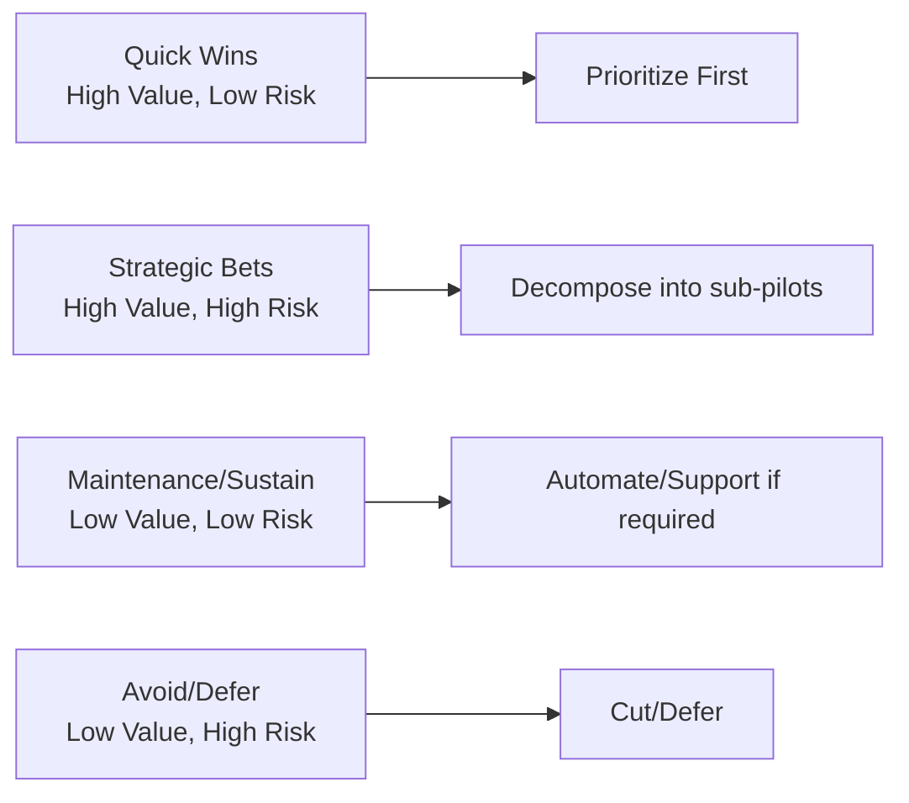
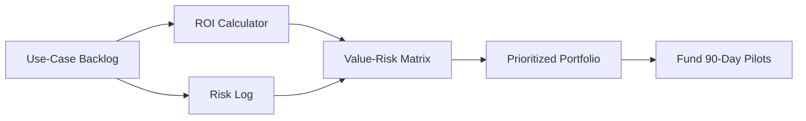
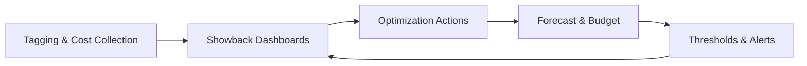

# Investment Strategy and Portfolio Shaping

## Introduction: from pilot to portfolio
Transition from a single successful pilot to a product‑centric portfolio that delivers sustained value. Use objective scoring and FinOps principles. Key artifacts: ROI Calculator and Risk Log.

## Principle 1: value scoring and portfolio prioritization
Use a Value‑Risk matrix to score initiatives.

- Business value (ROI): monetize KPI impact using the ROI calculator (benefit / fully loaded cost).
- Implementation risk: assess technical complexity, data availability/quality, and organizational adoption (DPO commitment).

Aim pilots at Quick Wins; treat Strategic Bets as sequenced sub‑pilots with risk mitigations.

Scoring workflow

## Principle 2: FinOps for data and AI initiatives
Bring financial accountability to variable cloud spend.

1) Cost transparency & showback
- Tag resources with product and DPO; show cost dashboards back to domain owners.

2) Efficiency and optimization
- Data tiering (Bronze to cold storage; Gold on hot compute)
- Right‑size/ephemeral compute; serverless where possible
- Budget thresholds and alerts (e.g., >20% over forecast)

3) Forecasting and budgeting
- Use historical consumption to forecast similar products.

## Tool: quantifying and mitigating risk (Risk Log)
Risk categories and sample mitigations:
- Data contract risk: require formal contracts with source owners before funding
- AI/model risk: add human‑in‑the‑loop and model performance SLOs
- Compliance/governance risk (NDPA 2023): mask/tokenize PII at Silver; controls to follow in governance session

Interactive exercise: score your pilot’s top 3 risks with impact, likelihood, and mitigation; update the Risk Log.

## Conclusion & transition to governance
You can now:
- Score initiatives by ROI and risk
- Apply FinOps to make costs transparent and optimized at the product level
- Proactively mitigate risks before execution

Next: Governance for the AI Era—mapping policies to technical controls for data, models, and access.
