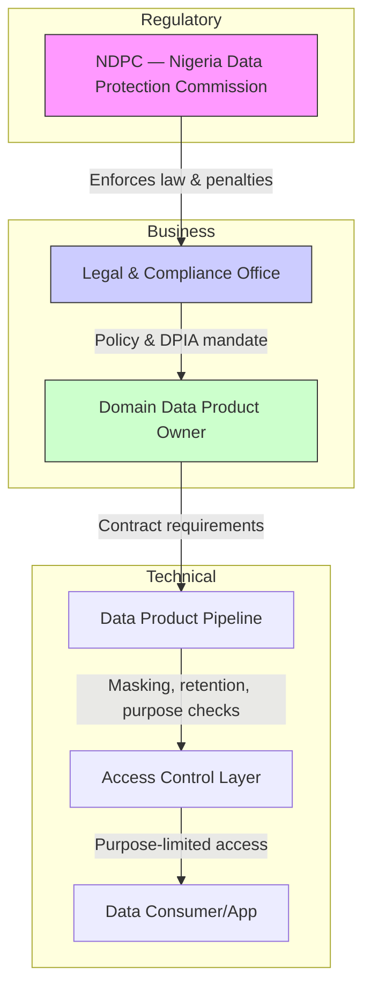

# Compliance Focus: Nigeria NDPA 2023 and Global Parity

## Introduction: mandate of trust and law
Compliance is a license to operate. NDPA 2023 establishes obligations enforced by the NDPC. Compliance is shared across Legal, DPOs, and engineers; build it into delivery using DPIA and data transfer assessments.

## NDPA 2023: core principles and NDPC
Seven pillars to encode in contracts and controls:
- Lawfulness, fairness, transparency
- Purpose limitation
- Data minimization
- Accuracy
- Storage limitation (retention)
- Integrity and confidentiality (security)
- Accountability

## Technical integration across lakehouse layers
- Bronze (ingestion control): retention tags and lifecycle policies for storage limitation and integrity.
- Silver (transformation control): data minimization via masking/pseudonymization/tokenization before joins and conformance.
- Gold (access control): purpose limitation and accountability using ABAC; serve minimal aggregated data.

Layered compliance defense

## Tooling: DPIA and cross‑border transfer assessment
- DPIA: required for high‑risk processing and new AI deployments; document processing, necessity, risks, mitigations; DPO + Legal approve before production.
- Data transfer assessment (global parity): ensure adequacy or implement SCCs/BCRs; encrypt in transit/at rest; evaluate destination legal conflicts.

## Summary and transition
Make the DPO accountable for principles; minimize at Silver; enforce purpose at Gold; perform DPIA and transfer assessments. Next: quality, observability, and reliability—SLOs/SLIs to keep products dependable.
