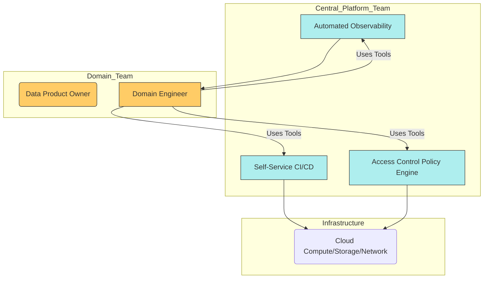
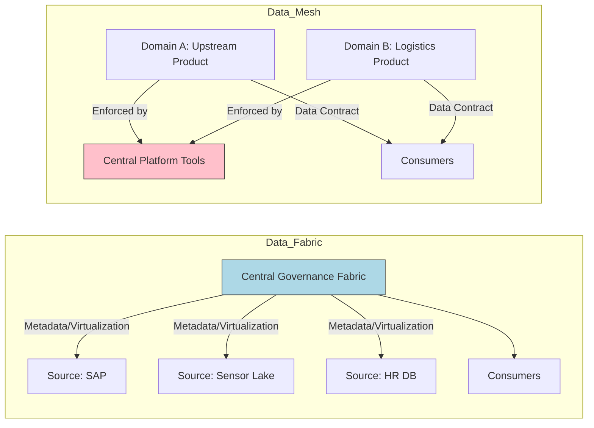
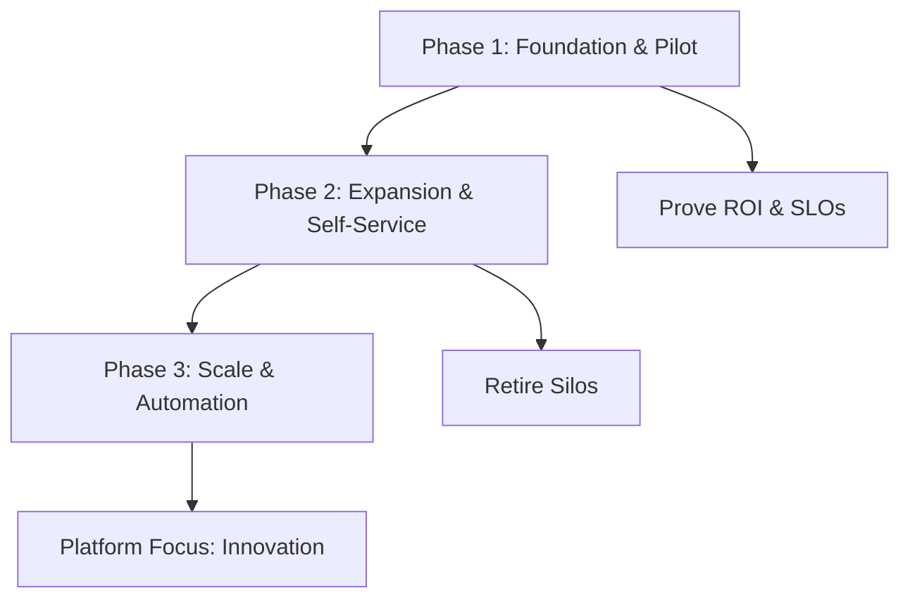

# Platform Blueprint and Reference Implementation Plan

## Introduction: the platform as enabler of trust
The data platform is a product that enables domain teams to launch governed, compliant, reliable data products without ticket queues. It enforces our operating model and provides self‑service tooling.

## Part 1: mandate — self‑service and automation
Platform team treats the platform as a product with its own roadmap, SLOs, and DPO. Capabilities include CI/CD, lineage, RBAC/ABAC policy‑as‑code, and FinOps showback.

## Part 2: strategic blueprints — data fabric vs data mesh
Both address silos; differ on ownership and control plane.

Mesh aligns with decentralized product ownership enforced by a central platform; Fabric centralizes integration and virtualization—choose based on culture and complexity.

## Part 3: phased implementation roadmap
Crawl‑walk‑run over ~3 years.

- Phase 1: Foundation & Pilot (0–9 months)
  - Architecture: basic lakehouse (Bronze/Silver/Gold) for one product
  - Governance: initial FinOps showback; RBAC/ABAC for pilot
  - Org: onboard first 1–2 DPOs; achieve pilot SLOs/ROI

- Phase 2: Expansion & Self‑Service (9–18 months)
  - Platform: self‑service CI/CD; automated lineage & observability
  - Compliance: tokenization/masking at Silver; NDPA alignment
  - Org: onboard 10–15 DPOs across 3 business units; retire 3–5 silos

- Phase 3: Scale & Automation (18+ months)
  - AI/ML: mature feature store & model registry; support agents
  - Global parity: automate data transfer assessments (SCCs/BCRs)
  - Architecture: streaming/edge across relevant sites; platform focuses on innovation

## Conclusion
The platform is the factory floor for data products—productized, self‑service, and governed. Next: capstone workshop—translate the 90‑day pilot into an executive one‑pager and an IT implementation brief.

Roadmap overview

