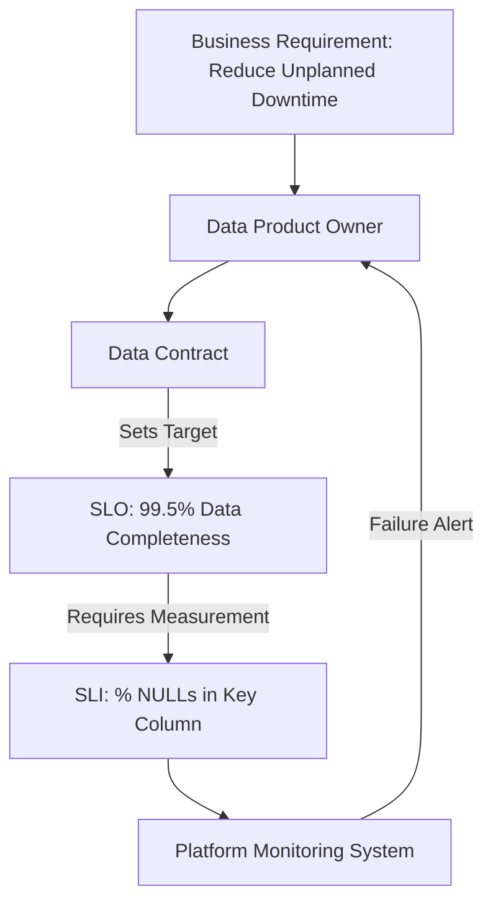
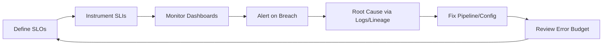
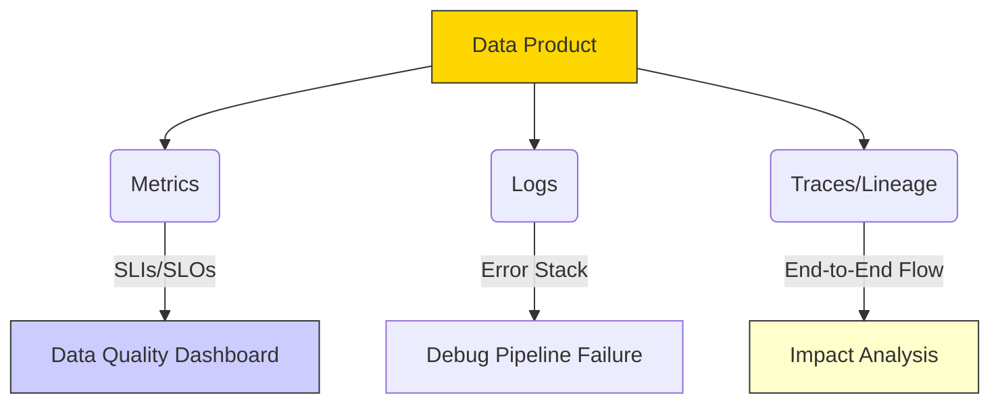

# Quality, Observability, and Reliability

## Introduction: the cost of untrustworthy data
Reliability is the new security. If data is wrong or late, AI and decisions fail. Establish SLOs/SLIs and observability so the promises in Data Contracts are measurable and enforceable. Artifact: Lineage + Observability Checklist.

## Part 1: defining reliability with SLOs and SLIs
- SLI: raw metric (e.g., freshness latency Bronze→Gold)
- SLO: target for the SLI over time (e.g., 99.5% within 60 minutes over 30 days)
- SLA: consequence/error budget

SLOs convert business need into measurable commitments; the platform measures SLIs and alerts on breach.

SLO management loop

## Part 2: the core three SLIs
- Freshness (timeliness): delta between event_timestamp and processing_timestamp; example target 99.9% < 5 minutes for PdM.
- Completeness (presence/volume): records received vs expected; % non‑NULL in key fields; example ≥99.5% wells daily and ≥99% non‑NULL production_volume.
- Accuracy (semantic/constraint): % values within valid ranges (e.g., 500–1,500 PSI); target ≥98%.

## Part 3: full data observability and lineage
Observability explains why failures happen using Metrics, Logs, and Traces (lineage).

- Metrics: what is wrong (freshness/completeness/accuracy trends)
- Logs: where in code it failed
- Traces/Lineage: who is impacted; supports governance questions (e.g., NDPA masking at Silver) and safe deprecations

## Activity: apply the checklist
1) Choose the most critical SLI for your pilot.
2) Set an SLO target.
3) Identify the lineage you must see when the SLO breaches (affected models/dashboards).

## Conclusion & transition
You’ve established measurable reliability and deep diagnosis. Next: the platform blueprint and reference implementation plan—who builds the tooling (lineage, serverless compute, CI/CD) and how to deliver it in phases.
