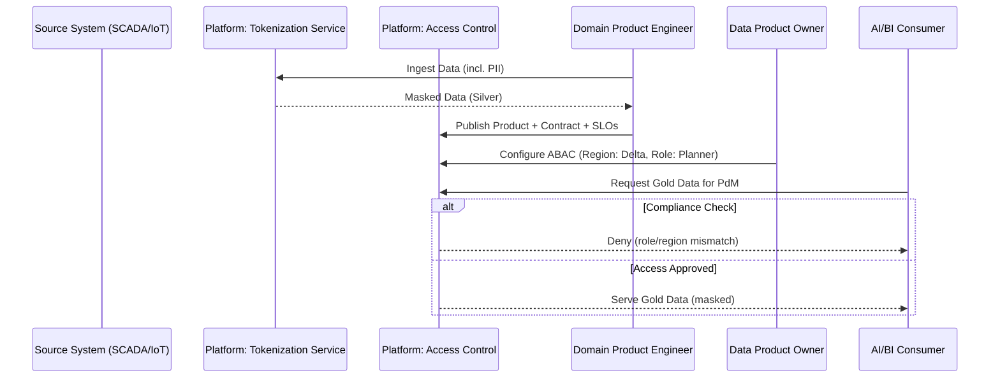
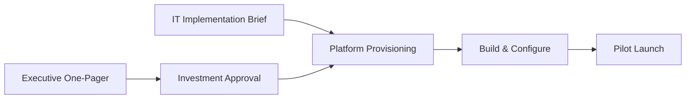

# Interactive Workshop: Pilot Plan to Production Path

## Introduction & challenge
Convert the 90‑day pilot design into two artifacts: an Executive One‑Pager (value, risk, readiness) and an IT Implementation Brief (architecture, tooling, controls). First half: business case. Second half: technical plan.

## Phase 1: executive one‑pager (the business case)
- Value proposition & ROI
  - Project title (business‑centric)
  - Targeted KPI and current state
  - Current cost/loss quantified
  - 90‑day goal and estimated ROI using the ROI calculator
  - Ownership: name the DPO and business unit
- Risk & organizational readiness
  - Value‑Risk matrix score (Quick Win / Strategic Bet)
  - Top 3 risks with paired mitigations (from Risk Log)
  - Day 91 scaling path (phase 2 scope and benefits)

## Phase 2: IT implementation brief (the technical plan)
- Architecture & data product definition
  - Product names and versions; Data Contract reference (schema, semantics)
  - Platform tooling requests (self‑service CI/CD, lineage, policy engine)
  - Primary pattern and layer focus (e.g., hybrid streaming/lakehouse; edge→Bronze/Silver)
- Governance & compliance controls
  - NDPA (PII) controls: tokenization/masking at Silver
  - Reliability SLOs/SLIs: freshness/completeness targets
  - Access/security: ABAC rules via platform policy engine

Artifacts handoff

## Conclusion
Two outputs ready for leadership and engineering: the executive one‑pager and the implementation brief. These secure funding and guide delivery from pilot to production.
