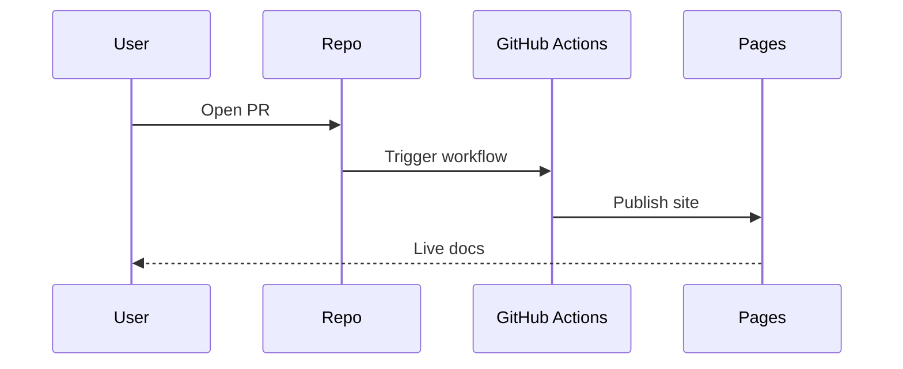

# Getting Started

This guide helps you set up and understand the WTAI documentation site.

## Prerequisites

- Python 3.8+
- MkDocs and Material theme (installed via pip)

## Run locally

```bash
mkdocs serve
```

Access at http://127.0.0.1:8000

## Mermaid diagram: Documentation workflow


## Mermaid diagram: Contribution process


