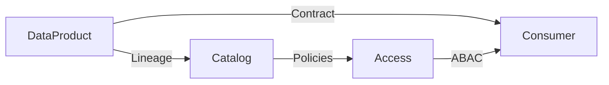
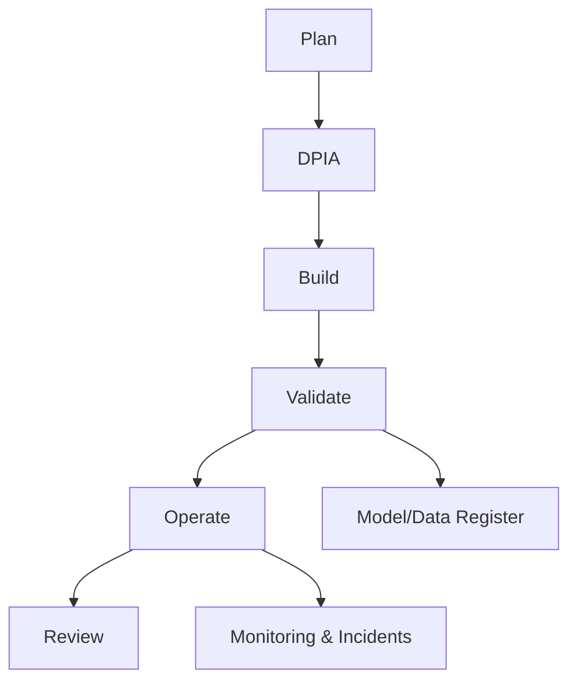

# Glossary

- Data-as-a-Product (DaaP): Treating datasets/services as owned products with SLAs/SLOs.
- Data Contract: Agreement on schema, semantics, quality, and freshness between producer/consumer.
- SLO/SLI: Objectives/indicators for reliability and data quality.
- Lineage: Trace of data origins and transformations across pipelines and products.
- ABAC: Attribute-based access control using attributes of subjects, objects, and context.
- RAG: Retrieval-Augmented Generation pattern for grounding LLM responses.
- Agentic Workflow: Automated orchestration with human-in-the-loop checkpoints.
- DPIA: Data Protection Impact Assessment of privacy risks.
- NDPA 2023: Nigeria Data Protection Act establishing principles and oversight.
- N-ATLAS: Nigeria’s open-source multilingual/multimodal LLM (Yoruba, Hausa, Igbo, Nigerian-accented English).

Concept map

Compliance lifecycle

