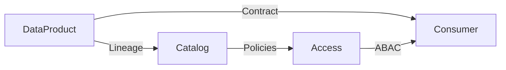
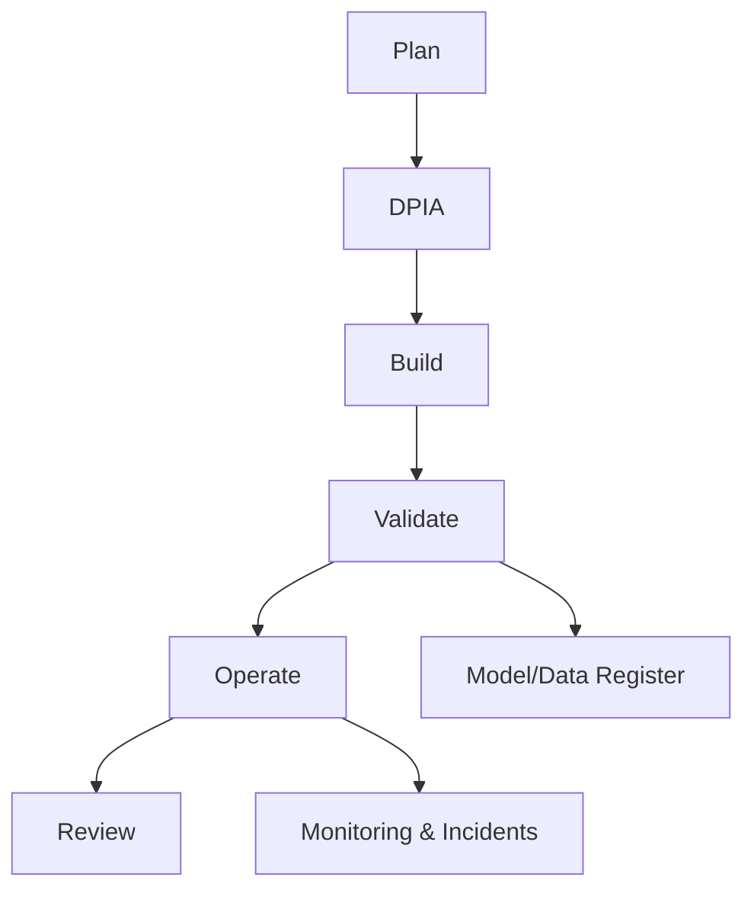

# Glossary

Tip: Use abbreviations like this in pages to get instant hover help: `DaaP`{:abbr="Data‑as‑a‑Product"}, `ABAC`{:abbr="Attribute‑Based Access Control"}. The entries below provide fuller definitions.

## Architecture & operating model
- Data‑as‑a‑Product (DaaP): Treating data artifacts and services as owned products with clear purpose, versioning, and SLOs; owned by a Data Product Owner (DPO) and delivered by a domain team.
- Data Product Owner (DPO): Business‑side owner accountable for value, contract, and SLOs of a data product; sets roadmap from KPI tree; approves model releases for safety‑critical use.
- Data Contract: Machine‑readable agreement defining schema, semantics, quality/freshness SLOs, PII handling, lifecycle, and purpose limitations for consumers.
- Medallion Lakehouse (Bronze/Silver/Gold): Layered refinement pattern for raw→conformed→business‑ready data with retention at Bronze, minimization at Silver, and access controls at Gold.
- Data Mesh: Organizational and architectural paradigm where domains own data products, enforced by central platform standards and tooling.
- Data Fabric: Centralized integration and metadata/virtualization layer that connects disparate sources with a unified access plane.
- Feature/Embedding Store: Central service to publish and reuse engineered features and embeddings consistently across models and agents.
- Streaming/Edge Analytics: Processing data in motion with local edge filtering and central streaming bus to meet tight latency SLOs.

## Governance, compliance & security
- Federated Governance: Split of policy intent (central) and control execution (domains) enforced by platform capabilities.
- ABAC (Attribute‑Based Access Control): Policies evaluate attributes of user, data, and context (e.g., role=Planner, region=Delta, purpose=Forecasting).
- Policy‑as‑Code: Declarative rules enforced automatically at runtime by the platform (e.g., access engine, data masking policies).
- NDPA 2023: Nigeria Data Protection Act establishing principles (lawfulness, purpose limitation, minimization, accuracy, storage limitation, security, accountability) and the NDPC regulator.
- DPIA: Data Protection Impact Assessment for high‑risk processing; documents processing, necessity, risks, mitigations; approved by Legal and DPO before production.
- Cross‑Border Transfer Assessment: Adequacy check or SCCs/BCRs plus encryption and legal review before exporting personal data.
- RACI: Responsibility matrix clarifying who is Responsible, Accountable, Consulted, and Informed for a task.

## Reliability & observability
- SLI (Service Level Indicator): Measurable signal of reliability or data quality (e.g., freshness latency, completeness %, valid‑range accuracy).
- SLO (Service Level Objective): Target for an SLI over a window (e.g., 99.5% completeness daily over 30 days); forms the core of the product promise.
- SLA (Service Level Agreement): Formal consequence or error budget policy when SLOs are breached.
- Lineage: End‑to‑end trace of data flow and transformations; supports impact analysis, audits, and responsible deprecations.
- Metrics/Logs/Traces: Three pillars of observability; metrics carry SLIs, logs aid debugging, traces/lineage show dependencies and impact.

## AI patterns
- RAG (Retrieval‑Augmented Generation): Ground LLM outputs with retrieved documents (hybrid search: keyword + vector) and provide citations.
- Agentic Workflow: Tool‑using, planning agents governed by input/output policies and human‑in‑the‑loop checkpoints.
- Model Registry: System of record for models with versions, lineage, approvals, and performance metrics; gates promotion to production.

## FinOps & investment
- FinOps: Financial accountability for variable cloud spend; tagging, showback, optimization, forecasting, thresholds/alerts at product level.
- Value‑Risk Matrix: Portfolio tool to categorize initiatives (Quick Wins, Strategic Bets, Sustain, Avoid) using ROI and risk scores.
- ROI Calculator: Quantifies benefits vs fully‑loaded costs (engineering, licenses, cloud) to prioritize investments.
- ROI: Return on Investment; ratio of net benefit to cost used to compare initiatives.

## Nigeria & local context
- NDPC: Nigeria Data Protection Commission—regulator for NDPA 2023.
- N‑ATLAS: Nigeria’s open‑source multilingual/multimodal LLM (Yoruba, Hausa, Igbo, Nigerian‑accented English) for localized interactions and documentation.

Concept map

Compliance lifecycle

