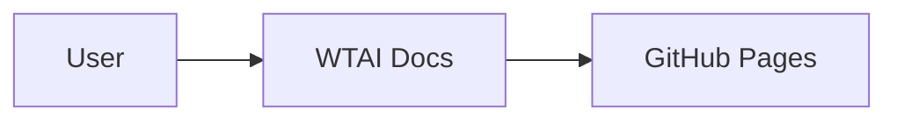
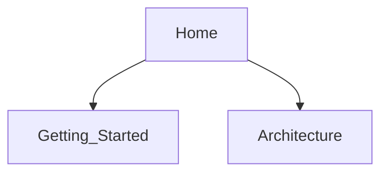

# Welcome to WTAI Docs

This is the documentation site for WTAI, built with MkDocs and Material.

## Quick start

```bash
mkdocs serve
```

Visit http://127.0.0.1:8000

## Mermaid diagram: Overview



## Mermaid diagram: Content map


