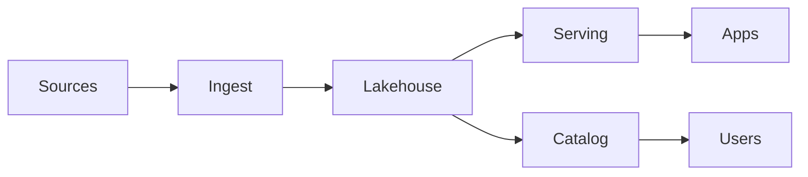
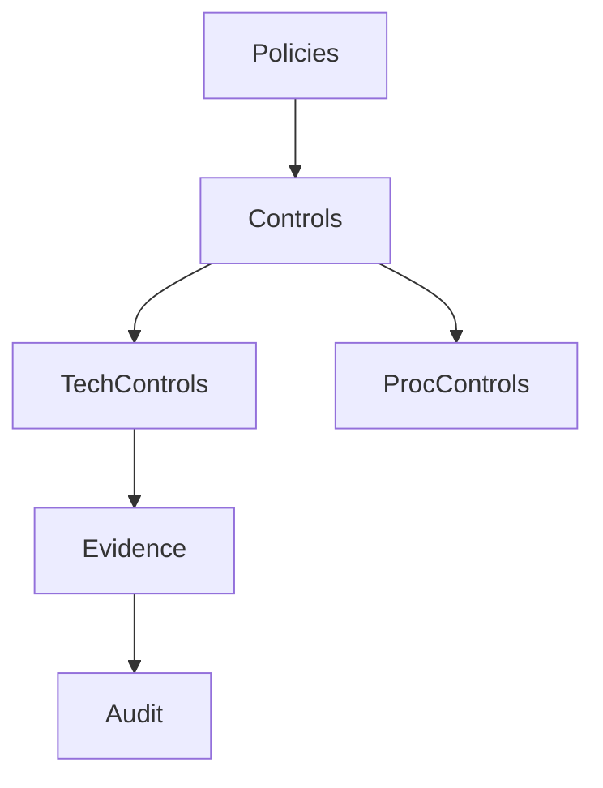

# Resources and References

Standards and frameworks
- DAMA-DMBOK2 — Data Management Body of Knowledge
- EDM Council DCAM — Data Management Capability Assessment Model
- EDM Council CDMC — Cloud Data Management Capabilities
- NIST AI RMF 1.0 and Generative AI Profile
- EU AI Act (obligations and timelines)
- ISO/IEC 42001 — AI management system standard
- ISO 8000 — Data quality
- ISO/IEC 27001 — Information security management

Nigeria regulations and guidance
- NDPA 2023 — Nigeria Data Protection Act
- NDPC — Nigeria Data Protection Commission; registration/licensing guidance
- Cross-border transfer safeguards and DPIA guidance

Architecture patterns and practices
- Data mesh vs data fabric decision guides
- Lakehouse and medallion architecture
- Streaming and edge analytics
- Knowledge graph + vector search integration
- Feature/embedding stores

Governance and controls
- Policy-to-control mapping and control catalogs
- Data contracts lifecycle (schema, semantics, SLOs)
- Lineage (e.g., OpenLineage patterns), observability SLIs/SLOs
- Access governance (ABAC, attribute tagging)
- DSPM concepts for sensitive data

RAG/LLMOps
- Retrieval quality evaluation, safety filtering, source attribution
- Risk registers and red-teaming playbooks
- Multilingual/local models: N-ATLAS for Yoruba/Hausa/Igbo/Nigerian-accented English

Measurement and FinOps
- ROI and risk scoring for data/AI portfolios
- Cost-to-serve models and SLO-driven optimization

Recommended reading
- Data product thinking and operating models
- Data quality and observability handbooks
- Model governance and AI policy primers

Architecture overview

Governance overview

