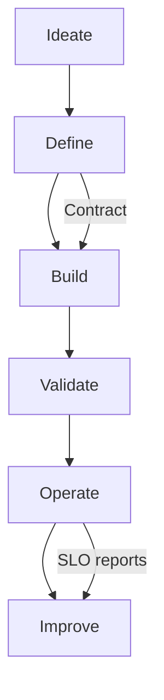
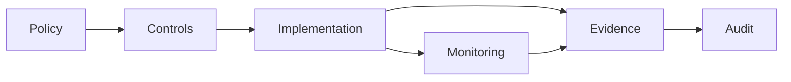

# Worksheets and Templates

Use directly in workshops; keep vendor-agnostic. Export to Teams or your preferred tool.

Templates
- KPI tree template (use-case -> KPI -> measure -> baseline -> target)
- Value hypothesis canvas (assumptions, risks, leading indicators)
- Data product canvas (purpose, owner, consumers, SLOs, versioning)
- Data contract template (schema, semantics, freshness, quality thresholds, PII)
- RAG risk register (risks, mitigations, evaluation metrics, fallback)
- ROI calculator (benefits, costs, risk-adjusted value)
- Lineage/observability checklist (SLIs, alerts, incident runbook)

Data product lifecycle

Governance workflow

Downloads
- [Data Product Canvas](worksheets/data_product_canvas.md)
- [Data Contract Template](worksheets/data_contract_template.md)
- [RAG Risk Register](worksheets/rag_risk_register.md)
- [ROI Calculator](worksheets/roi_calculator.xlsx)
- [Lineage & Observability Checklist](worksheets/lineage_checklist.md)
